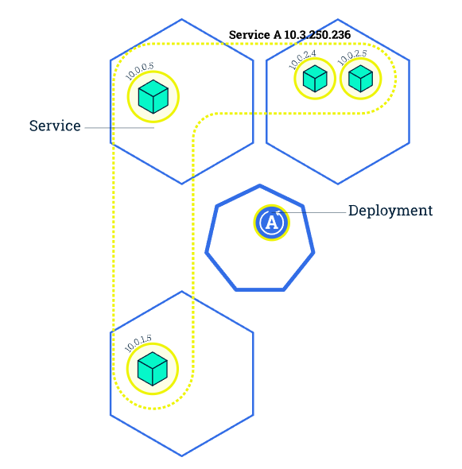

# Kubernetes Basics

## The Kubernetes Cluster

- Kubernetes coordinates a highly available cluster of computers that are connected to work as a single unit.
- Kubernetes automates the distribution and scheduling of application containers across a cluster in a more efficient way.
- A Kubernetes cluster consists of two types of resources:
  - Control Plane
  - Nodes

- The Control Plane is responsible for managing the cluster.
  - i.e. scheduling apps, maintaining desired state, scaling, and rolling out updates.
- A Node is a VM or a physical computer that servers as a worker machine in a Kubernetes cluster.
  - Each node has a Kublet (an agent) for managing the node and communicating with the control plane.
- The nodes communicate with the control plane using the Kubernetes API.
  - Exposed by the control plane. End users can use it to interact with the cluster
  - When you deploy apps on Kubernetes, you tell the control plane to start the app containers
  - The control plan schedules the containers to run on the cluster's nodes

## The Kubernetes Deployment

- You deploy contrainerized applications on top of a Kubernetes cluster.
- You have to create a deployment configuration.
- The deployment instructs Kubernetes how to create and update instances of your app.
- The Kubernetes control plane schedules the app instances in that deployemnt to run on indiviudal nodes on the cluster.
- The controller continuously monitors those instances and replaces them if something goes wrong.
- The provides a self-healing mechanism to address machine failure or maintenance.

- You can create and manage a deployment with the Kubernetes CLI - kubectl.
- Kubectl uses the Kubernetes API to interact with the cluster.
- Deployments require a container image and the number of replicas you want to run.

## Kubernetes Pods and Nodes

- Deployments create a pod to host your app instance.
- A pod is a Kubernetes abstraction that represents a group of one or more app containers (such as Docker) and some shared resources for those containers:
  - Storage volumes
  - Networking, as a unique clsuter IP address
  - Information about how to run each container (image, version, ports)
- A pod is like a logical host containing tightly coupled app containers.
- The containers in a pod share an IP address and port space, are always co-located, and co-scheduled, and run in a shared context on the same node.
- Pods are the atomic unit on the Kubernetes platform.
- A deployment creates pods with containers inside them isntead of running containers directly.
- Each pod is tied to the node where it's scheduled and remains there until termination or deletion.
- If a node fails, identical pods are scheduled on other available nodes in the cluster.

- A pod always runs on a node.
- A node is a worker machine in Kubernetes (virtual or physical).
- Each node is managed by the control plane.
- A node can have multiple pods.
- The Kubernetes control place automatically handles scheduling the pods acrtoss the nodes in a cluster.
- The control plane scheduler takes into account the available resources on each node.
- Ever Kubernetes node runs at least:
  - Kubelet (process responsible for communication between the control plan and the node, also manages the containers)
  - Container runtime (Docker, containerd, etc).
  

## The Kubernetes Service

- A Kubernetes Services is an abstraction which defines a logical set of Pods and a policy by which to access them.
- Services enable loose coupling between dependant pods.
- Services are defined using YAML (preferred) or JSON.
- The set of pods targeted by a services is usually determined by a LabelSelector.
- IPs are not exposed outside of the clsuter without a service.
- Services are exposed by specifying a type int he ServiceSpec:
  - ClusterIP - exposes the service on an internal IP in the cluster.
  - NodePort - exposes the service on the same port of each selected node in the cluster using NAT.
  - LoadBalancer - creates an exetrnal load balancer in the current cloud and assigns a fixed, external IP to the service.
  - ExternalName - maps the services to the contents of the external name field by returning a CNAME record with its value.
- A service routes traffic across a set of pods.
- Services are the abstraction that allow pods to die and replicate in Kubernetes without impacting your application.
- Discovery and routing among dependant pods is handled by the Kubernetes service.
- Services match a set of pds using labels and selectors, a grouping primitive that allows logical operation on objects in Kubernetes.
- Labels are key/value pairs attached to objects and can be used:
  - To designate objects for dev, test, prod
  - Embed version tags
  - Classify an object using tags
- Labels can be attached to objects at creation or later on, and modified any time.
- Services have an integrated loab-balancer to distribute traffic to all exposed pods of a deployment.

## Scaling Apps with Kubernetes

- Scaling is accomplished by changing the number of replicas in the Deployment.

- Scaling ensures new pods are created and scheduled to nodes with available resources.
- Scaling changes number of pods to the desired state.
- Kubernetes supports autoscaling.
- With multiple replicas, you can take advantage of zero-downtime rolling updates.

## Kubernetes Rolling Updates

- Deploy new versions of your app multiple times per day.
- Update deployments with zero downtime.
- Incrementally update pods with new ones. SCheduled on nodes with available resources.
- Rolling updates require scaling your deployment.
- By default, the maximum number of pods that can be unavailable during the update is one.
- By default, the maximum number of new pods that can be create is one.
- Kubernetes updates are versioned and any deployment update can be reverted to a previous stable version.

- Services will load-balance traffic to available pods during an update, if exposed.